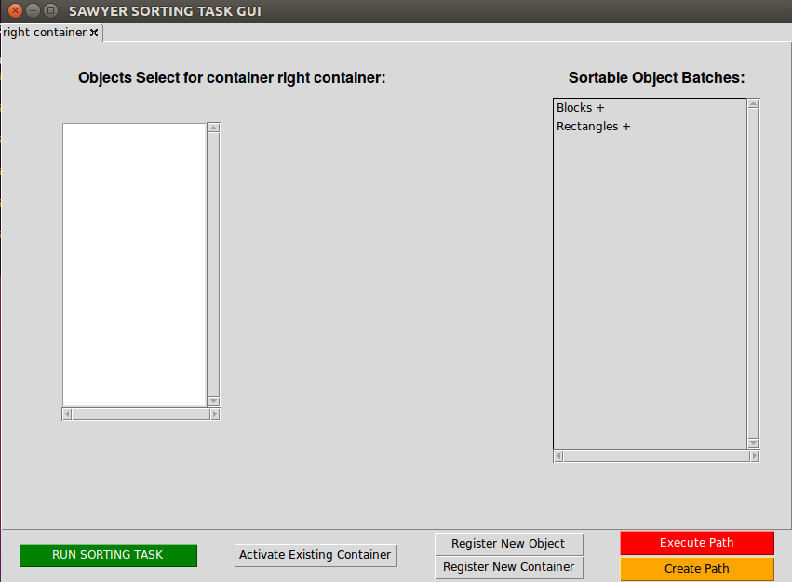
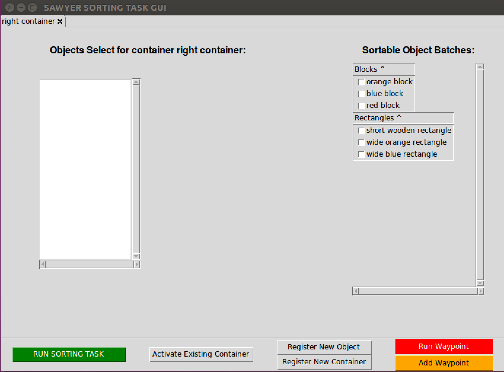

# Designing a UI for Complex Sorting Tasks

## Aims of this project
The aim of this project is to construct a Graphical User Interface (GUI) which is accessible to users who have little to no experience with collaborative robots. The extent to which we have succeeded in creating such a system will be evaluated via the use of sorting tasks as a vehicle to test if our implementation is sound.

## Implementation Specifications
This project has been implemented using `python 2.7`, the final product was deployed on the [`Sawyer`] robot from [`Rethink Robotics`]. 

## GUI
The GUI has been implemented using `python 2.7` and its corresponding `TkInter` package. 

### Main Launch screen
The implementation of the current launch screen is displayed below, this is what the user will see when they first launch the application. For illustration purposes we have provided screen captures of how this looks.

## Sawyer Functionality
The `Sawyer` robot will serve as a medium through which we can test how our designed GUI integrates with the functions a robot would need to perform in order to successfully complete a given sorting task. Hence the robot must be capable of **moving towards objects and containers in a 3D space** as well as being able to **pick up objects** as specified by the user of our GUI. Users can use the GUI to introduce new objects and containers to the system, while also being able to construct custom paths which the robot will follow when instructed to do so.
  
