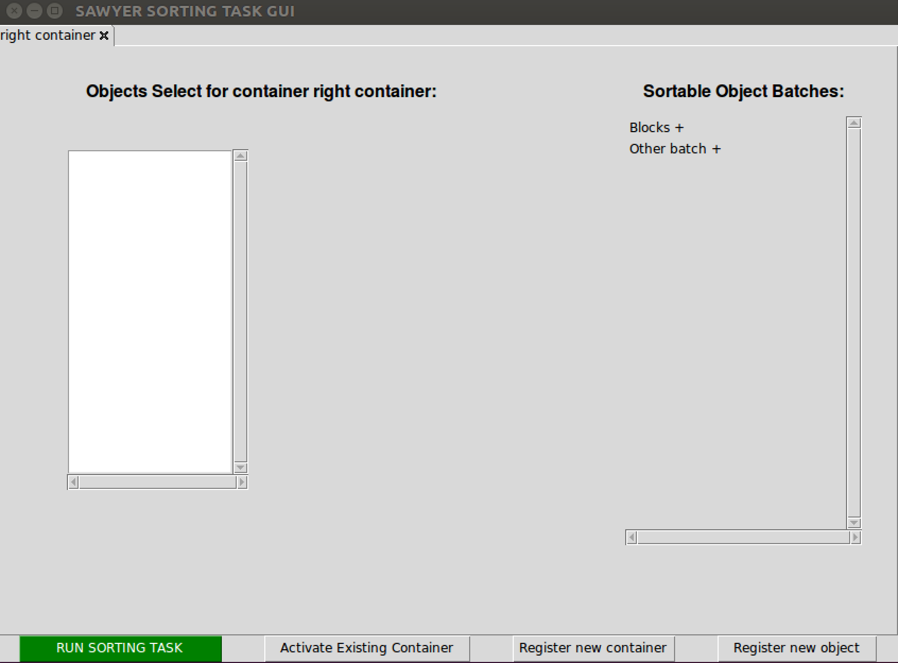
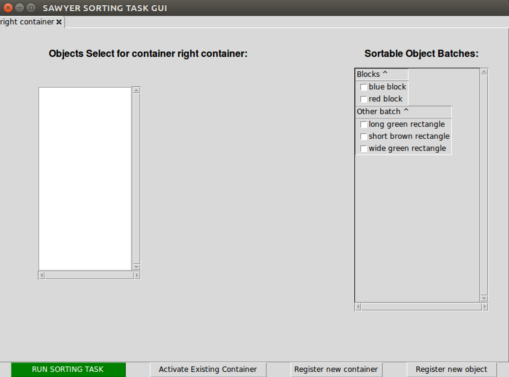

# Designing a UI for Complex Sorting Tasks

## Aims of this project
The aim of this project is to construct a Graphical User Interface (GUI) which is accessible to users who have little to no experience with collaborative robots. The extent to which we have succeeded in creating such a system will be evaluated via the use of sorting tasks as a vehicle to test if our implementation is sound.

## GUI
The GUI has been implemented using [`python 2.7`] and its corresponding [`TkInter`] package. 

### Main Launch screen
The implementation of the current launch screen is displayed below, this is what the user will see when they first launch the application. For illustration purposes we have provided screen captures of how this looks.

